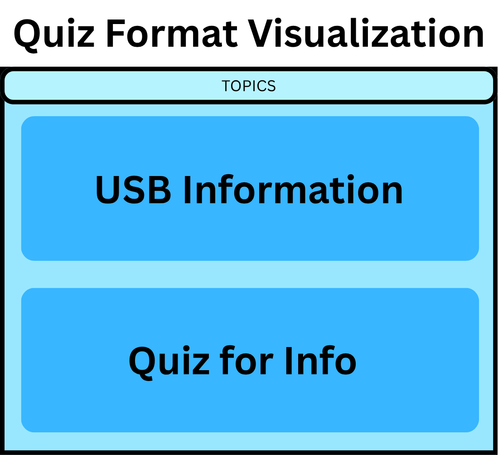

# A USB (C)omplete guide and deep dive
[Website Link](https://virtual-exhibit-template.onrender.com/usb)

## Member Roster:
Stefan Domingo\
Ewan Escano\
Martin Gamilla\
Frederick Garcia\
Hanz Gutierrez

## Topic Theme
A deep dive discussion of the USB-C protocol and how it works to interface with many common I/O
## Tech Stack Plan
### Frontend Framework: React - 
We will use React to build a modular, component-based user interface that enables seamless navigation through the virtual exhibit.
### Language: TypeScript - 
TypeScript will be utilized for static typing, ensuring type safety and reducing runtime errors throughout the development process.
### Styling: CSS3 and HTML5 - 
HTML5 will provide the structural foundation for the content, while CSS3 will be used to create a visually engaging and modern aesthetic for the exhibit.
### Component Structure: 
Functional components using React hooks will manage application state, allowing for dynamic updates and interactivity throughout the user experience.
### Responsive Design: 
Tailwind CSS Flexbox and Grid - We will implement CSS Flexbox and Grid layouts to ensure the exhibit is fully responsive and optimized for a consistent viewing experience across mobile, tablet, and desktop devices.

## Proposed Interactive Element:
As our primary interactive component, we will develop a dynamic quiz application embedded directly into our exhibit's .mdx page. Prior to the quizzes, each topic will have a brief discussion regarding it. The quiz will be built using React state hooks to manage user inputs, score tracking, and real-time feedback. To provide a comprehensive assessment of the user's understanding, the quiz will feature four distinct interaction modes totalling to 23 questions:
1. Drag-and-Drop Port Classification (8 questions)
Mechanic: Users will be presented with draggable text blocks representing specific hardware characteristics (e.g., "Full-duplex data flow", "Rigid 5V limit", "Reversible orientation"). They must drag and drop these features next to the correct physical connector (USB-A, USB-B, USB-C, or Micro-USB).\
**Purpose**: This tests the user's ability to compare USB-C's underlying architecture and capabilities against legacy USB standards.
2. Component Identification (5 questions)
Mechanic: Leveraging an interactive diagram of the 24-pin layout, the quiz will prompt the user with a functional requirement, such as "Select the pin(s) that provide a complete return path for data and electrical current." The user must physically click the correct corresponding pins (e.g., the GND pins) on the diagram to submit their answer.\
**Purpose**: This transitions the user from rote memorization to spatial and structural understanding of the hardware logic.

3. Multiple Choice with Dynamic Context (5 questions) 
Mechanic: A standard four-option layout testing deeper concepts like power delivery negotiation or multiplexing. The defining feature here is the dynamic feedback loop: upon selecting an answer, an explanation block immediately renders to explain exactly why the choice was correct or incorrect.\
**Purpose**: This ensures the quiz acts as an active learning tool rather than just a grading mechanism, seamlessly reinforcing the exhibit's main text.

4. True or False (5 questions)
Mechanic: Users will evaluate common misconceptions about USB architecture. For example, assessing statements like, "You can tell a port's USB-C generation based solely on its physical look." The UI will utilize immediate visual indicators (green and red bounding boxes) upon selection.\
**Purpose**: This serves as a quick knowledge check to clear up consumer-level misunderstandings about the physical port versus the underlying protocol standards.

## Tentative Style Guide Snapshot

.png)
.png)
.png)

## Incremental Documentation
Our documentation is also detailed in this [file](Incremental_Documentation.md)

### Mid-milestone submission (July 5, 2026)
Regrettably we began working rather late on our mid-milestone submission given the hectic ILW with many other tasks and majors taking up our backlog. 

For most of us, it is our first time working with React but it wasn't as difficult as we expected thanks to our experience with JavaScript from last term with CCAPDEV. The real knowledge gap came with markdown as most of us were introduced to the syntax just this term. Integrating markdown and JS was a new experience for all of us.

Actualizing our proposal was also a bit of a hurdle as we all collectively were more experienced with backend development so interactive elements and UI were not our strong suit.

Nevertheless we were able to finish our technical content and even finish half of our quizzes, some issues remain such as the rendered USB-C model not behaving properly on our deployed website vs locally on our computers. However we are optimistic we will address these issues as soon as possible.

### (July 6, 2025)
All our previous issues from yesterday have mostly been resolved. The model displays properly on our deployed website and we were able to plan and finish all our quizzes so our interactive elements have been completed for now.

For now we are pleased with the current state of our website and feel it is refined enough to submit. We agreed on as a group to begin working on it again after both LBYARCH and CSARCH2 exams conclude by the end of the week.

For now these are our current goals:

Fix the minute page size changes that occur when browsing through the different USB types.
Fine tune the model render aspect ratio so it is full view throughout the whole rotation.

